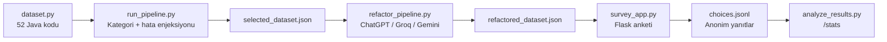

# HUMAN-AI

**İnsanların yapay zeka ile refaktörize edilmiş Java kodlarına ne kadar güvendiğini ölçen bir araştırma anketi.**

Katılımcılar, aynı görevi yapan dört Java kod versiyonunu (Kaynak Kod, Gemini, ChatGPT, Groq) yan yana görür ve en güvenilir bulduklarını seçer. Yanıtlar tamamen anonim olarak kaydedilir; kişisel bilgi istenmez.

---

## İçindekiler

- [Araştırma Amacı](#araştırma-amacı)
- [Nasıl Çalışır?](#nasıl-çalışır)
- [Proje Yapısı](#proje-yapısı)
- [Veri Hazırlama Hattı](#veri-hazırlama-hattı)
- [Hata Enjeksiyonu](#hata-enjeksiyonu)
- [Anket Özellikleri](#anket-özellikleri)
- [Kod Kategorileri](#kod-kategorileri)
- [Kurulum](#kurulum)
- [Yerel Çalıştırma](#yerel-çalıştırma)
- [Render ile Yayınlama](#render-ile-yayınlama)
- [Sonuç Analizi](#sonuç-analizi)
- [Veri Şeması](#veri-şeması)
- [Gizlilik](#gizlilik)
- [Önemli Notlar](#önemli-notlar)

---

## Araştırma Amacı

Bu proje şu sorulara yanıt aramak için tasarlanmıştır:

1. Katılımcılar **kaynak koda mı** yoksa **LLM refaktörlerine mi** daha çok güvenir?
2. **Hangi LLM** (ChatGPT, Groq, Gemini) en sık tercih edilir?
3. Kaynak kodda **bilinçli olarak enjekte edilmiş hatalar** varken katılımcılar yine de kaynak kodu mu seçer?

Araştırma verisi, katılımcıların her soruda yaptığı seçimlerden (`choices.jsonl`) ve `/stats` sayfasındaki anonim özet istatistiklerden üretilir.

---

## Nasıl Çalışır?



**Özet akış:**

1. **52 adet** çalışma amaçlı Java kodu tanımlanır (`experiments/dataset.py`).
2. **20 kodda** ince semantic hata enjekte edilir; temiz hali `original_code`, LLM'lere giden hali `code_for_llm` olarak ayrılır.
3. Üç LLM aynı refaktör talimatlarıyla kodları yeniden yazar (`experiments/refactor_pipeline.py`).
4. Anket uygulaması her oturumda **rastgele 5 soru** sunar; katılımcı dört versiyondan birini seçer.
5. Yanıtlar JSONL formatında saklanır ve analiz edilir.

---

## Proje Yapısı

```
HUMAN-AI/
├── app/
│   └── survey_app.py          # Flask anket uygulaması (ana UI)
├── experiments/
│   ├── dataset.py             # 52 Java kod tanımı
│   ├── bug_injector.py        # 20 koda semantic hata enjeksiyonu
│   ├── code_categories.py     # 12 kategori + anket prompt'ları
│   ├── run_pipeline.py        # Dataset export + hata enjeksiyonu
│   ├── refactor_pipeline.py   # LLM refaktör hattı
│   ├── code_bridge.py         # Dataset ↔ LLM köprüsü
│   ├── llm_clients.py         # ChatGPT, Groq, Gemini istemcileri
│   ├── study_prompts.py         # LLM refaktör talimatları
│   ├── analyze_results.py     # Terminal + /stats analizi
│   └── check_refactor_status.py # Refaktör tamamlanma kontrolü
├── data/
│   ├── raw_repos/
│   │   └── selected_dataset.json    # Hazırlanmış 52 kod
│   ├── refactored/
│   │   └── refactored_dataset.json  # 3 LLM refaktör çıktısı
│   └── results/
│       ├── choices.jsonl            # Anket yanıtları (gitignore)
│       ├── active_sessions.json     # Sunucu tarafı oturum durumu
│       └── completed_tokens.json    # Tek katılım token'ları
├── wsgi.py                    # Production giriş noktası (gunicorn)
├── render.yaml                # Render Blueprint yapılandırması
├── DEPLOY.md                  # Deploy rehberi
├── requirements.txt
└── .env.example
```

---

## Veri Hazırlama Hattı

### 1. Dataset export + hata enjeksiyonu

```bash
python experiments/run_pipeline.py
```

- `experiments/dataset.py` içindeki 52 kodu okur.
- Her koda **12 kategoriden birini** atar.
- **Tam 20 koda** (seed=42, deterministik) semantic hata enjekte eder.
- Çıktı: `data/raw_repos/selected_dataset.json`

### 2. LLM refaktörü

```bash
# .env dosyasında API anahtarları gerekli
python experiments/refactor_pipeline.py
python experiments/refactor_pipeline.py --force   # Mevcut çıktıları yeniden üret
python experiments/refactor_pipeline.py --limit 5 # Sadece ilk 5 kod (test)
```

- Her kod için **ChatGPT**, **Groq** ve **Gemini** refaktör çıktısı üretir.
- LLM'lere `code_for_llm` gönderilir (hatalı versiyon dahil).
- Tüm modeller aynı sistem prompt'unu alır (`experiments/study_prompts.py`, sürüm `human-ai-v1`).
- Çıktı: `data/refactored/refactored_dataset.json`

### 3. Durum kontrolü

```bash
python experiments/check_refactor_status.py
```

52 kodun üç LLM için tamamlanıp tamamlanmadığını gösterir.

---

## Hata Enjeksiyonu

52 kodun **20'sinde** bilinçli, ince semantic hatalar vardır. Amaç: katılımcıların kaynak koda körü körüne güvenip güvenmediğini ölçmek.

| Özellik | Değer |
|---------|-------|
| Hatalı kod sayısı | 20 / 52 |
| Seçim yöntemi | `random.Random(42)` ile deterministik |
| Temiz kaynak | `original_code` alanında saklanır |
| Ankette görünen kaynak | `code_for_llm` (20 kodda hatalı olabilir) |

**Hata tipleri:**

| Tip | Açıklama |
|-----|----------|
| `wrong_comparison` | Arama/sıralama mantığında `<` / `>` ters çevrilir |
| `inverted_condition` | `if` koşulu tersine çevrilir |
| `off_by_one_loop` | Döngüde `i < n` → `i <= n` |
| `arithmetic_flip` | Aritmetik ifadede `+` / `-` ters çevrilir |
| `wrong_return_sentinel` | `return -1` → `return 0` |

Ankette **Kaynak Kod** etiketi, katılımcıya gösterilen `code_for_llm` sürümünü temsil eder; bu sürüm bilinçli hata içerebilir.

---

## Anket Özellikleri

| Özellik | Açıklama |
|---------|----------|
| Oturum başına soru | 5 (rastgele seçilir) |
| Seçenekler | Kaynak Kod, Gemini, ChatGPT, Groq |
| Etiketleme | Açık etiketler (kör A/B/C/D değil) |
| Tek katılım | Cihaz başına bir kez (`ha_survey_completed` çerezi + sunucu token'ı) |
| Oturum yönetimi | Sunucu tarafı `active_sessions.json` (çerez kaybına dayanıklı) |
| Kategori prompt'u | Her soruda konuya özel açıklama metni |
| İlerleme çubuğu | 5 soruluk oturum boyunca görsel ilerleme |
| İstatistik sayfası | `/stats` — anonim pasta ve çubuk grafikler |

**Sayfalar:**

| URL | Açıklama |
|-----|----------|
| `/` | Ana sayfa — çalışma bilgisi ve ankete başla |
| `/survey` | Soru ekranı |
| `/thanks` | Teşekkür sayfası |
| `/stats` | Anonim toplu istatistikler |

---

## Kod Kategorileri

52 kod **12 kategoriye** dağıtılmıştır; her kategorinin kendine özel anket açıklaması vardır:

| Kategori | Konu |
|----------|------|
| Arama ve Filtreleme | Kayıt arama, filtreleme |
| Sıralama ve Önceliklendirme | Sıralama algoritmaları |
| Metin ve String İşlemleri | Metin normalizasyonu, doğrulama |
| Veri Yapıları | Tampon, yığın, kuyruk vb. |
| Finans ve Hesaplama | Para, faiz, hesap |
| Doğrulama ve Güvenlik | Şifre, IBAN, giriş kontrolü |
| Ayrıştırma ve Veri Yolu | CSV, yol birleştirme |
| Graf ve Ağaç | Derinlik, yol birleştirme |
| Zaman ve İş Akışı | Toplantı çakışması, throttle |
| Dizi ve İstatistik | Ortalama, medyan, histogram |
| İş Mantığı | Rezervasyon, stok, fiyatlandırma |
| Kodlama ve Sıkıştırma | Checksum, bayrak paketleme |

Kategori listesi: `python experiments/list_categories.py`

---

## Kurulum

**Gereksinimler:** Python 3.11+

```bash
git clone https://github.com/Yunus-bayat/HUMAN-AI.git
cd HUMAN-AI
python -m venv .venv

# Windows
.venv\Scripts\activate

# macOS / Linux
source .venv/bin/activate

pip install -r requirements.txt
cp .env.example .env
```

`.env` dosyasını düzenleyin (refaktör hattı için gerekli; anket deploy'u için değil):

```env
GROQ_API_KEY=...
CHATGPT_API_KEY=...
GEMINI_API_KEY=...
FLASK_SECRET_KEY=uzun-rastgele-bir-string
FLASK_DEBUG=0
PORT=5000
```

> **Not:** Canlı anket yalnızca önceden üretilmiş `refactored_dataset.json` dosyasını kullanır. Deploy sırasında API anahtarı **gerekmez**.

---

## Yerel Çalıştırma

```bash
# Geliştirme sunucusu
python app/survey_app.py
# → http://127.0.0.1:5000

# Production benzeri test
pip install gunicorn
gunicorn wsgi:app --bind 127.0.0.1:5000
```

**Yararlı komutlar:**

```bash
python experiments/run_pipeline.py          # Dataset + hata enjeksiyonu
python experiments/refactor_pipeline.py     # LLM refaktörü
python experiments/check_refactor_status.py # Refaktör durumu
python experiments/analyze_results.py       # Terminal analizi
```

---

## Render ile Yayınlama

Proje [Render](https://render.com) Blueprint ile tek tıkla deploy edilebilir.

1. Render → **New** → **Blueprint** → `Yunus-bayat/HUMAN-AI` reposunu bağla
2. Branch: `main`, Blueprint Path: `render.yaml` (varsayılan)
3. **Deploy Blueprint** — `render.yaml` otomatik okunur

`render.yaml` şunları ayarlar:

- Build: `pip install -r requirements.txt`
- Start: `gunicorn wsgi:app --bind 0.0.0.0:$PORT --workers 2 --timeout 120`
- `FLASK_SECRET_KEY`: Render tarafından otomatik üretilir

Detaylı adımlar için [`DEPLOY.md`](DEPLOY.md) dosyasına bakın.

**Ücretsiz plan notu:** ~15 dakika istek gelmezse servis uyku moduna geçer; ilk tıklamada 30–60 saniye açılabilir.

---

## Sonuç Analizi

### Tarayıcı (canlı)

```
https://SIZIN-URL/stats
```

Anonim pasta grafiği (kaynak vs. LLM) ve LLM karşılaştırma çubuk grafiği gösterir.

### Terminal

```bash
python experiments/analyze_results.py
```

Örnek çıktı metrikleri:

- Toplam seçim ve katılımcı sayısı
- Kaynak koda güvenen seçimler (%)
- LLM'lere güvenen seçimler (%)
- En çok tercih edilen LLM
- Hatalı kod setinde kaynak vs. LLM tercihi

---

## Veri Şeması

### Anket yanıtı (`choices.jsonl`, her satır bir JSON)

```json
{
  "response_id": "uuid",
  "timestamp": "2026-07-29T10:00:00+00:00",
  "survey_mode": "four_way",
  "session_questions": 5,
  "question_number": 1,
  "code_id": "code_12",
  "description": "Siparis listesinde musteri kimligine gore kayit arama",
  "category": "search",
  "category_label": "Arama ve Filtreleme",
  "choice_label": "ChatGPT",
  "chosen_source": "chatgpt",
  "has_injected_bug": false,
  "bug_type": null,
  "bug_id": null
}
```

### Refaktör dataset (`refactored_dataset.json`)

Her kayıt: `id`, `description`, `category`, `original_code`, `code_for_llm`, `has_injected_bug`, `refactored.chatgpt`, `refactored.groq`, `refactored.gemini`

---

## Gizlilik

- Ad, e-posta veya kimlik bilgisi **toplanmaz**.
- Yalnızca hangi versiyonun seçildiği anonim olarak kaydedilir.
- `/stats` sayfası yalnızca **toplu, anonim** istatistik gösterir.
- Bireysel yanıtlar herhangi bir yerde açıklanmaz.
- Anket linki paylaşılmadıkça herkese açık değildir; şifre koruması yoktur (link = erişim).

---

## Önemli Notlar

### Kod kaynağı

Kodlar `study.*` paketleri altında **çalışma amaçlı yazılmış** Java parçacıklarıdır. `source_reference` alanları (`study://human-ai/...`) dahili tanımlayıcılardır; GitHub'dan kopyalanmış gerçek depo kodları değildir. Makalede *"açık kaynak kalıplarından esinlenilmiş, çalışma amaçlı kod parçacıkları"* olarak tanımlanmalıdır.

### Git'e commit edilmeyenler

`.gitignore` ile korunan dosyalar:

- `.env` (API anahtarları)
- `data/results/*` (anket yanıtları — yalnızca `.gitkeep` repoda)
- Log dosyaları

### Bağımlılıklar

| Paket | Kullanım |
|-------|----------|
| Flask | Anket web uygulaması |
| gunicorn | Production WSGI sunucusu |
| openai | ChatGPT refaktörü |
| groq | Groq refaktörü |
| google-generativeai | Gemini refaktörü |
| python-dotenv | Ortam değişkenleri |

---

## Lisans

Bu proje bir akademik araştırma çalışmasıdır. Kullanım ve atıf koşulları proje sahibi ile görüşülmelidir.

---

**Geliştirici:** [Yunus Bayat](https://github.com/Yunus-bayat)
